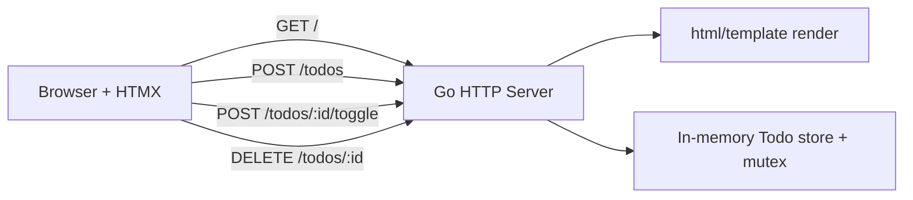

[](https://github.com/safwanehfaz/go-htmx-todo/releases/tag/v0.1.1)
[](https://go.dev/)
[](https://github.com/safwanehfaz/go-htmx-todo/actions/workflows/release.yml)
[](https://github.com/safwanehfaz/go-htmx-todo)

## What is this?

A minimal todo app using **pure Go** (`net/http`, `html/template`) and **HTMX** with no backend frameworks or extra Go libraries.

## Highlights

- Server-rendered UI with HTMX-powered add/toggle/delete interactions
- Single-binary app
- Multi-platform release artifacts
- Release is now blocked unless all required targets build successfully
- CLI lifecycle controls: start/stop/quit/status/autostart
- Persistent storage in JSON (survives restarts)

## Architecture at a glance



## Download

Choose your platform from release assets:

| Platform | Arch | File |
|---|---|---|
| Linux | x86_64 | `linux-amd64.tar.gz` |
| Linux | arm64 | `linux-arm64.tar.gz` |
| Linux | armv7 | `linux-armv7.tar.gz` |
| macOS | x86_64 | `darwin-amd64.tar.gz` |
| macOS | arm64 | `darwin-arm64.tar.gz` |
| Windows | x86_64 | `windows-amd64.zip` |
| Windows | arm64 | `windows-arm64.zip` |
| Android (Termux) | arm64-v8a | `android-arm64-v8a.tar.gz` |
| Android (Termux) | armv7 | `android-armv7.tar.gz` |

## Quick start

```bash
go run .
```

Open `http://localhost:8080`.

## Integrity (SHA256)

Use `checksums.txt` to verify downloads.

```bash
sha256sum -c checksums.txt
```

## Full changelog

- Enforced Android armv7 build in CI release pipeline
- Added strict release gating so failed builds do not publish release assets
- Added `togx` lifecycle commands and graceful/force stop options
