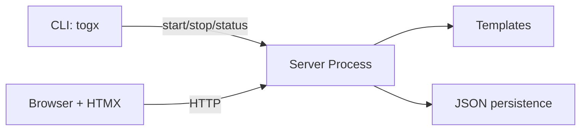

[](https://github.com/safwanehfaz/go-htmx-todo/releases/tag/v0.1.2)
[](https://go.dev/)
[](https://github.com/safwanehfaz/go-htmx-todo/actions/workflows/release.yml)
[](https://github.com/safwanehfaz/go-htmx-todo)

## Highlights

- New `togx` lifecycle CLI: `start`, `stop`, `quit`, `status`, `autostart`
- `stop --force` / `-f` for hard stop, graceful shutdown by default
- `Ctrl+C` exits cleanly and removes pid file
- Persistent todos stored in JSON (`$XDG_CONFIG_HOME/togx/todos.json`)
- Release pipeline keeps strict build gating before publish

## Architecture



## Quick Start

```bash
togx start --foreground
```

Open `http://127.0.0.1:8080`.

## Included binaries

- Linux: `amd64`, `arm64`, `armv7`
- macOS: `amd64`, `arm64`
- Windows: `amd64`, `arm64`
- Android/Termux: `arm64-v8a`, `armv7`

## Verify downloads

```bash
sha256sum -c checksums.txt
```
